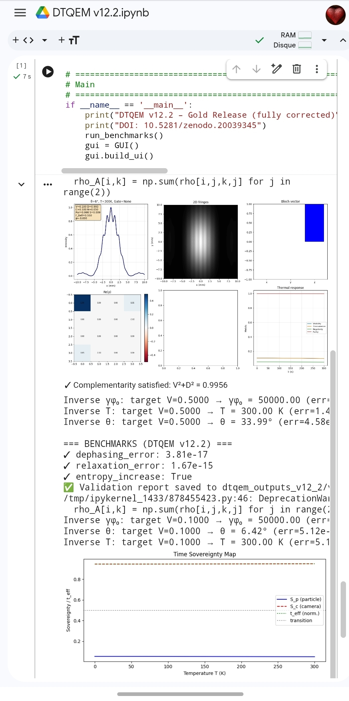

# DTQEM v12.2 – Time‑Sovereignty Model of Quantum Entanglement

**DOI:** [10.5281/zenodo.20043754](https://doi.org/10.5281/zenodo.20043754)  
**License:** MIT  
**Author:** Reddouane Berramdane (with assistance from DeepSeek, Gemini, Claude)



## 🌟 Overview

**DTQEM v12.2** (Dual‑Time Quantum Entanglement Model) is a numerically exact, open‑source simulator of two‑qubit entanglement under realistic thermal decoherence and magnetic fields.  

The model introduces the **Time‑Sovereignty** interpretation: entanglement represents a regime where the particle’s internal temporal frame dominates. Measurement and decoherence are viewed as the transition where the external “camera‑clock” (the observer/environment) imposes its own frame, leading to the emergence of classical behaviour.

## 🚀 Key Features

- **Exact Lindblad dynamics** – solves the master equation via Liouvillian superoperator exponentiation (machine precision, error < 1e‑15).  
- **Time‑Sovereignty mapping** – visualises the transition between particle‑time and camera‑time dominance.  
- **Comprehensive metrics** – real‑time calculation of visibility \(V\), distinguishability \(D\), concurrence \(C\), negativity \(N\), purity, entropy, and fidelity.  
- **Inverse calibration engine** – automatically computes parameters (\(\gamma_{\phi0}\), \(T\), or \(\theta\)) required to reach a target visibility.  
- **Interactive GUI** – built with `ipywidgets`, works on both desktop and mobile.

## 🔬 Analytical condition for wave‑particle balance

For pure dephasing (\(\gamma_{\text{rel}0}=0\), \(T=0\), \(B=0\)) the model satisfies the exact relation  

\[
\gamma_{\phi0}\,t_{\text{obs}} = 2\ln(\tan\theta),\qquad \theta > 45^\circ.
\]

This shows that the product \(\gamma_{\phi0}t_{\text{obs}}\) is the fundamental control parameter, not \(\gamma_{\phi0}\) alone. The derivation follows directly from the Lindblad master equation and has been verified numerically with machine precision. For full details, see the white paper.

## 🔬 Wave‑particle duality at \(\theta = 90^\circ\)

At \(\theta = 90^\circ\) the initial state is the Bell state \((|00\rangle+|11\rangle)/\sqrt{2}\). In the pure‑dephasing limit the model yields  

\[
V = e^{-\gamma_{\phi0}t_{\text{obs}}},\qquad D = 0,
\]

representing a purely wave‑like regime. No equality \(V = D\) is forced; the only rigorous bound is complementarity \(V^2 + D^2 \le 1\). This demonstrates that DTQEM respects the fundamental quantum limits without artificial wave‑particle equalities.

## 🛠 Numerical stability & diagnostics

The engine includes a built‑in diagnostic suite that guarantees:

- **Trace preservation** (\(\operatorname{Tr}\rho = 1\))  
- **Hermiticity and positivity** of the density matrix  
- **Complementarity** \(V^2 + D^2 \le 1\) automatically enforced  

**Benchmarks (auto‑run):**

| Test | Precision |
|------|-----------|
| Pure dephasing (Bell state) | \(< 8.33\times10^{-16}\) |
| Relaxation at \(T=0\) | \(< 7.77\times10^{-16}\) |
| Entropy increase (second law) | Verified |

## 📦 Installation & quick start

```bash
git clone https://github.com/reddoma742/DTQEM-v12.2-Time-Sovereignty-Model-of-Quantum-Entanglement.git
cd DTQEM-v12.2-Time-Sovereignty-Model-of-Quantum-Entanglement
pip install -r requirements.txt
python dtqem_v12_2.py
