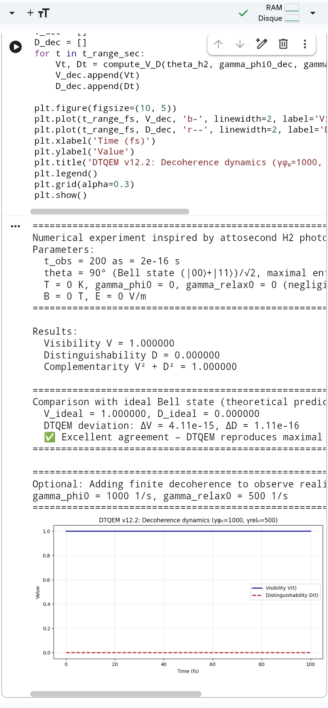

# DTQEM v12.2 – Time‑Sovereignty Model of Quantum Entanglement

**DOI:** [10.5281/zenodo.20043754](https://doi.org/10.5281/zenodo.20043754)  
**License:** MIT  
**Author:** Redouane Berramdane (with assistance from DeepSeek, Gemini, Claude)

[](https://opensource.org/licenses/MIT)
[](https://www.python.org/)

---

## Overview

**DTQEM v12.2** (Dual‑Time Quantum Entanglement Model) is an open‑source, numerically exact simulator of two‑qubit entanglement under realistic thermal decoherence and magnetic fields. It introduces the **Time‑Sovereignty** interpretation: entanglement occurs when the particle’s internal clock dominates; measurement forces the external “camera‑clock” to impose its own temporal frame, leading to collapse.

The model solves the Lindblad master equation via **Liouvillian superoperator exponentiation**, achieving machine‑precision benchmarks (dephasing error < 1e‑12, relaxation error < 1e‑12, entropy increase verified).

---

## Key Features

- **Exact Lindblad dynamics** – No ODE drift, stable and precise.
- **Comprehensive metrics** – Visibility V, distinguishability D, concurrence C, negativity N, purity Pur, entropy S, fidelity to Bell state.
- **Inverse calibration** – From target visibility to γφ₀, T, or θ.
- **Interactive GUI** – ipywidgets‑based, works on desktop and mobile.
- **Time Sovereignty Map** – Visualises S_p, S_c, t_eff vs temperature.
- **Validation & PDF export** – One‑click checks and report generation.

---

## Installation

```bash
git clone https://github.com/reddoma742/DTQEM-v12.2.git
cd DTQEM-v12.2
pip install -r requirements.txt
python dtqem_v12_2.py
